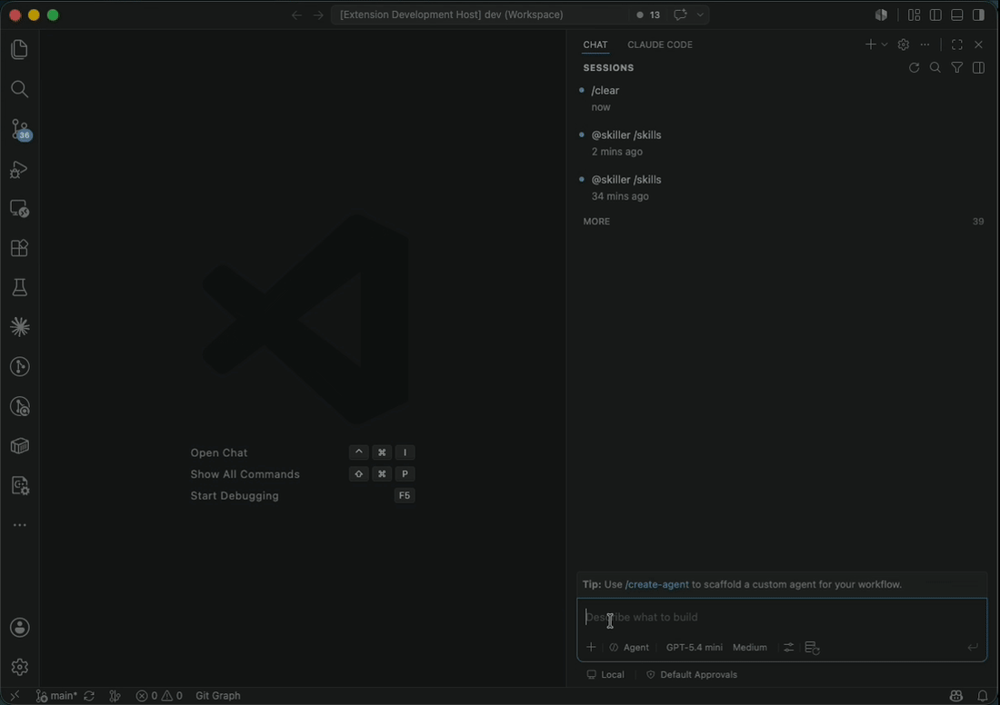

<div align="center">


# Skiller

**Declarative, human-in-the-loop workflow runner for VS Code chat.**

Write branching YAML playbooks that orchestrate your language model and MCP tools — with review and input steps — and run them from the `@skiller` chat participant.

[](https://marketplace.visualstudio.com/items?itemName=tivaliy.skiller)
[](LICENSE)



### 📖 Full documentation → <https://tivaliy.github.io/skiller/>

</div>

---

## What is Skiller?

Skiller runs **skills** — declarative, multi-step workflows defined in YAML and Markdown. Each skill is a playbook: a sequence of steps that call a language model, invoke your [MCP](https://modelcontextprotocol.io) tools, and pause for your input or approval exactly where you tell them to.

It is deliberately **not** a free-form agent and **not** an "Agent Skills" auto-loader:

| | Free-form agent | **Skiller** |
| --- | --- | --- |
| Control flow | Model decides what to do next | **You** define the steps; the model fills them in |
| Side effects | Can act on its own | Runs **only** the steps you wrote, pausing for confirmation where you ask |
| Reproducibility | Varies run to run | Same playbook, same shape every time |
| Branching | Implicit | Explicit `confirmation` steps with `goto` jumps |

If you want predictable, reviewable automation that still leverages an LLM — not an autonomous agent — Skiller is for you. As a skill runs, you can watch it as a **live execution graph**, with branches and loops lighting up as they fire.

## Requirements

- **VS Code 1.93+**
- A **chat language model provider** (e.g. GitHub Copilot, or any provider exposing VS Code's Language Model API)
- **MCP servers** configured in VS Code (optional — only needed for tool integrations)

## Quick start

### Install

**From the Marketplace:**

```text
ext install tivaliy.skiller
```

**From source:**

```bash
npm install
npm run package
code --install-extension skiller-*.vsix
```

### Run your first skill

Open the Chat view and talk to `@skiller`:

```text
@skiller /help            Show available commands
@skiller /skills          List discovered skills
@skiller /skill greeter   Run the built-in "greeter" example skill
```

A message that is **not** a slash command and **not** a skill gets a short hint — Skiller does not do free-form chat.

See the [Getting Started tutorial](https://tivaliy.github.io/skiller/getting-started/introduction/) to install, run a skill, and author your own.

## Learn more

The docs are the single source of truth. Jump to what you need:

- **[Run a built-in skill](https://tivaliy.github.io/skiller/getting-started/run-a-bundled-skill/)** and **[Write your first skill](https://tivaliy.github.io/skiller/getting-started/write-your-first-skill/)** — guided tutorials.
- **Guides** — how-to for [tool/MCP skills](https://tivaliy.github.io/skiller/guides/tool-mcp-skill/), [branching & looping](https://tivaliy.github.io/skiller/guides/branching-looping/), [debugging](https://tivaliy.github.io/skiller/guides/debugging/), and [models](https://tivaliy.github.io/skiller/guides/models/).
- **[Skills & discovery](https://tivaliy.github.io/skiller/concepts/skills-and-discovery/)**, **[Step types & state](https://tivaliy.github.io/skiller/concepts/step-types/)**, **[Templating with Liquid](https://tivaliy.github.io/skiller/concepts/templating/)**, and **[The execution graph](https://tivaliy.github.io/skiller/concepts/execution-graph/)** — how it all works.
- **[skill.yaml manifest](https://tivaliy.github.io/skiller/reference/skill-yaml/)** and **[step-file frontmatter](https://tivaliy.github.io/skiller/reference/step-frontmatter/)** — every field.
- **[Commands](https://tivaliy.github.io/skiller/reference/commands/)** — all `@skiller` slash commands.
- **[Settings](https://tivaliy.github.io/skiller/reference/settings/)** — every `skiller.*` setting and its default.
- **[Built-in tools](https://tivaliy.github.io/skiller/reference/built-in-tools/)** — `skiller_createFile` and `skiller_replaceInFile`.

## Contributing

Issues and pull requests are welcome. See **[Contributing & development](https://tivaliy.github.io/skiller/contributing/)** for build, test, and PR guidelines, and for running the Extension Development Host.

## License

Licensed under the [MIT License](LICENSE).
