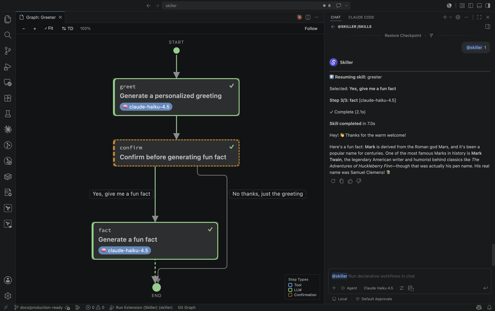

Every `skill.yaml` has a **live execution graph**: a first-class visual surface that shows
the skill's steps as connected nodes and lights them up as the skill runs. It is the
fastest way to understand a skill's control flow, watch a run unfold, and inspect what each
step actually saw and produced.

Open it from the **"Show Graph"** [CodeLens](#open-the-graph) above any `skill.yaml`, then
run the skill from `@skiller` chat — the graph and the run are connected.

## The renderer

The graph is laid out by [ELK.js](https://github.com/kieler/elkjs) and drawn as hand-rolled
SVG. Layout and node measurement happen inside the webview; the extension only ships a
structural description of the graph. All assets (the layout engine and the pan/zoom helper)
are vendored and loaded under a strict Content Security Policy, so the panel works fully
offline.

Each node is a card colored by step type — green for `llm`, blue for `tool`, orange (dashed)
for `confirmation` — plus rounded `start` and `end` terminals. Cards carry small badges for
the model (🧠) and any tools (🔧) a step uses. A legend in the corner maps the colors to
the three step types.

## Live state highlighting

As a skill executes, the extension streams state into the graph. Each node reflects one of
six states:

| State | Appearance |
| ----- | ---------- |
| **pending** | dimmed (not yet reached) |
| **active** | pulsing border + a one-shot pop when it starts |
| **awaiting-input** | a slower pulse, to read as *waiting* rather than *running* (a `confirmation` paused for your click) |
| **completed** | a ✓ mark in the corner |
| **error** | the pulse retinted red |
| **skipped** | dimmed and dashed (a `when` condition was false) |

The traversed path is drawn too. The transition currently firing animates as **marching
ants** (a flowing dashed edge); once the run moves on, that edge settles into a static
"already taken" trail. This is exactly how branches and loops become visible — a backward
`goto` lights up the edge that jumps back, a forward `goto` lights up the edge that branches
ahead. Edges carry labels for branch, `goto`, and loop transitions so you can read the flow
without opening the manifest.

The graph stays in sync even if you switch tabs: when the panel comes back, it re-applies
every step's current state, the terminal states, and the model-override banner from the live
run.

:::tip
A model chosen in the chat model dropdown overrides the skill's configuration and shows a
**Model Override** banner across the top of the graph. See
[Use & override models](../../guides/models/).
:::

## Hover inspection

Hover an executed node to peek at what it actually saw and produced. After a short delay, a
popover appears with:

- a meta line — the **model**, **duration**, **tools used**, and **status**;
- the **fully-interpolated prompt** the step received (templates already rendered);
- for `llm` steps, the model's **response**.

The popover has two actions:

- **Open ↗** opens the captured prompt/response as a read-only document (under the
  `skiller-inspect://` scheme). It is never writable, so there is no accidental edit and no
  "save?" prompt — and it refreshes in place when the step re-runs, so a loop always shows
  its latest iteration.
- **Copy** copies the prompt to the clipboard.

Inspection is available for `llm` and `confirmation` steps; `tool` steps and skipped steps
have no captured prompt/response, so hovering them shows a short "nothing captured" note.
Captured data is **session-scoped**: it lives as long as the run's execution state and is
cleared on reset.

<!-- SCREENSHOT TODO (owner): hover-inspection popover over an executed node — captured live from the running extension. Drop the image here, e.g.  -->

This is the single best debugging tool when a prompt isn't behaving — see
[Debug a skill](../../guides/debugging/).

## Navigating the graph

The toolbar gives you the usual canvas controls:

- **Zoom in / out** and a **Fit** button (the current zoom level is shown as a percentage).
- **Pan** by dragging; mouse-wheel and double-click zoom.
- A **direction toggle** flips the layout between top-down (TD) and left-right (LR). Your
  choice is persisted across reloads.
- **Follow** auto-pans the canvas to the active step as the run advances — handy for long
  skills where the live step would otherwise scroll off screen. Its on/off state is also
  remembered.

**Click any node** to jump straight to that step's line in `skill.yaml`. The graph and the
source stay in lockstep.

## Open the graph

A **"Show Graph"** CodeLens sits above every `skill.yaml`. Click it to open (or re-focus)
the panel for that skill — there is one panel per skill, reused on reopen. You can also open it
from chat: `@skiller /skills <id>` shows a skill's details and opens its graph in the side panel.

<!-- SCREENSHOT TODO (owner): the "Show Graph" CodeLens above the first line of a skill.yaml — captured live from the editor. Drop the image here, e.g.  -->

Running a skill from chat also drives whichever graph panel is open for it — the run and its
graph stay in lockstep, as in the view at the top of this page.

## Live reload and validation

The panel re-renders as you edit `skill.yaml` — add, rename, or rewire a step and the graph
updates. If an edit makes the file invalid, the panel surfaces the problem inline:
**parse errors** and **schema-validation errors** appear as a banner over the graph
(warnings show as a collapsible panel), so you catch a broken manifest the moment you save
rather than at run time.

## Next steps

- **[Branch & loop with confirmations](../../guides/branching-looping/)** — author the
  control flow this graph animates.
- **[Debug a skill](../../guides/debugging/)** — use hover inspection and live validation to
  find problems fast.
- **[Step types](../step-types/)** — the `llm`, `confirmation`, and `tool` steps the graph
  draws.
- **[`skill.yaml` reference](../../reference/skill-yaml/)** — every field the graph reads.
