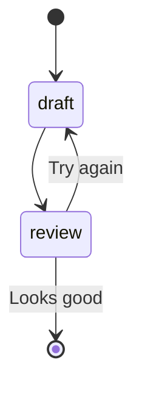

A skill's `steps` run in order. Every step has a unique `id`, a `type`, and an optional `output`
name. There are three types.

## `llm` — call the model

Renders a [Liquid](https://liquidjs.com/) prompt and sends it to the model.

| Field | Description |
| ----- | ----------- |
| `file` | Path to a Markdown prompt file, relative to the skill directory |
| `message` | Inline prompt (use instead of `file`) |
| `model` | Model alias or ID for this step (optional) |
| `tools` | MCP tool aliases the model may call (agentic tool use) |
| `tool_mode` | `auto` (model decides) or `required` (must call a tool) |
| `output` | Name to store the reply under — read it as `outputs.<name>` |

An `llm` step needs either `file` or `message` (not both).

## `confirmation` — pause for a human

Shows a message with buttons and waits for your click. This is Skiller's human-in-the-loop core.

| Field | Description |
| ----- | ----------- |
| `message` / `file` | The text to show (Liquid-templated) |
| `options` | The buttons — each has a `label` and an `action` |
| `output` | Stores the choice; the chosen label is at `outputs.<name>.selectedOption` |

Each option's `action` is one of:

- `continue` — proceed to the next step
- `abort` — stop the skill
- `goto` — jump to another step (set `goto_step: <step id>`); this is how you branch and loop

## `tool` — invoke one MCP tool

Calls a single MCP tool directly (no model), with templated parameters.

| Field | Description |
| ----- | ----------- |
| `tool` | The tool alias to invoke (required) |
| `params` | Parameters passed to the tool (Liquid-templated) |

## How state flows between steps

Steps **don't share conversation history** — each `llm` call is independent. State travels only
through `outputs`: a step with `output: draft` stores its result, and later steps (and their
prompts) read it as `{{ outputs.draft }}`.

When an `llm` reply is valid JSON, Skiller parses it, so you can read individual fields:

```yaml
- id: draft
  type: llm
  file: steps/01-draft.md   # replies with { "message": "..." }
  output: draft
- id: review
  type: confirmation
  message: "{{ outputs.draft.message }}"   # ← reads the parsed field
```

## The live execution graph

As a skill runs, Skiller renders it as a Mermaid state diagram in a side panel — branches and `goto`
loops light up as they fire. The same diagrams render right here in the docs:



Optional per-step fields: `description`, `when` (a Liquid condition that skips the step when it's
false), and `requires` (step IDs that must run first). Every field is listed in the
[`skill.yaml` reference](../../reference/skill-yaml/).
