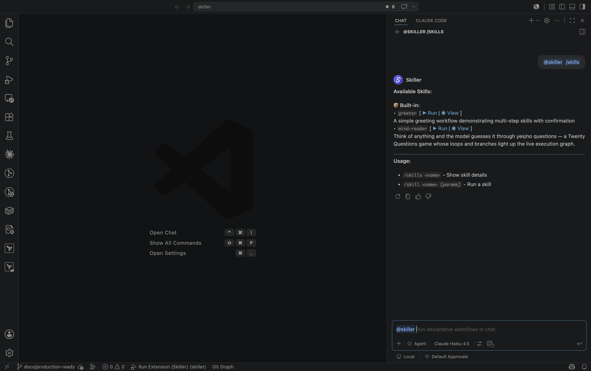

Skiller ships with two **built-in example skills** — `greeter` and `mind-reader` — so you can run a
real workflow before writing one. This walkthrough has you list them, run each, and watch the
[live execution graph](../../concepts/execution-graph/) react as the steps fire.

## 1. List the available skills

Open the Chat view and ask `@skiller` what it can run:

```text
@skiller /skills
```

You'll see `greeter` and `mind-reader` (plus any skills you've added in your workspace or user
folder), each with **Run** and **View** actions:



If the list looks stale after you edit a `skill.yaml`, run `@skiller /reload` to re-scan.

## 2. Run `greeter` — meet the confirmation pause

```text
@skiller /skill greeter
```

`greeter` prompts for your name, generates a personalized greeting, then **pauses** and asks whether
you'd also like a fun fact. That pause is a `confirmation` step — Skiller's human-in-the-loop core.
Nothing happens until you click an option:

- **Yes, give me a fun fact** continues to the next step.
- **No thanks, just the greeting** aborts the run there.

You can pass launch arguments to skip the prompt:

```text
@skiller /skill greeter name=Ada
```

## 3. Run `mind-reader` — watch the graph branch and loop

```text
@skiller /skill mind-reader
```

`mind-reader` is a game of Twenty Questions: think of something, and the model asks yes/no questions
until it guesses. Each answer you click either **loops back** to ask another question or **branches
forward** to the guess — control flow driven by `goto` confirmation options.

Open the skill's [live execution graph](../../concepts/execution-graph/) — run `@skiller /skills mind-reader`
(or click **View** in the `/skills` list), which opens it in the side panel — then play a few rounds.
Watch the active step highlight, the traversed edge animate,
and the loop edge light up each time you send the model back to ask again. This branching and looping
is the surface the graph is built to make visible.

## Commands

`/skills`, `/skill`, and `/reload` are three of nine `@skiller` slash commands. For the full set —
including the `/status`, `/cancel`, and `/reset` control commands — see the
[Commands reference](../../reference/commands/).

A message that is **not** a slash command and **not** a skill gets a short hint. Skiller doesn't do
free-form chat.

---

Ready to build your own? [Write your first skill →](../write-your-first-skill/)
